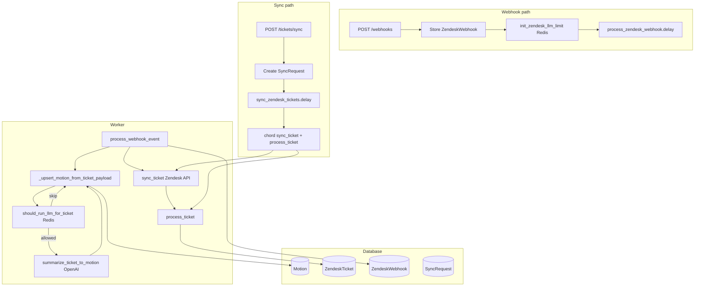

# FastAPI + Celery + Redis + Zendesk + OpenAI + DB — Step-by-Step Plan

This plan follows [.cursorrules](.cursorrules), [zendesk-full-flow.md](.cursor/skills/celery-redis-jobs/zendesk-full-flow.md), and [reference.md](.cursor/skills/celery-redis-jobs/reference.md). You execute each step manually.

---

## Architecture Overview (Zendesk + OpenAI + DB)




---

## Phase 1: Init Project

**Goal:** Project skeleton with dependencies.


| Step | Action                                                                                         | Reference                                                                                     |
| ---- | ---------------------------------------------------------------------------------------------- | --------------------------------------------------------------------------------------------- |
| 1.1  | Create `pyproject.toml` with `uv init` or manually                                             | [toy-greenfield-scaffold](.cursor/rules/toy-greenfield-scaffold.mdc)                          |
| 1.2  | Add deps: `fastapi`, `uvicorn`, `celery[redis]`, `redis`, `pydantic-settings`, `python-dotenv` | Phase 1 in [toy-fastapi-celery-scaffold](.cursor/skills/toy-fastapi-celery-scaffold/SKILL.md) |
| 1.3  | Optional: add `ruff` for lint/format                                                           | Phase 1                                                                                       |


**Check:** `uv sync` or `pip install -e .` succeeds.

---

## Phase 2: Config and Worker

**Goal:** Celery app that connects to Redis.


| Step | Action                                                                                                                    | Reference                                                                                                               |
| ---- | ------------------------------------------------------------------------------------------------------------------------- | ----------------------------------------------------------------------------------------------------------------------- |
| 2.1  | Create `config.py` with `Settings` (Pydantic), `redis_url`, `@property def redis`                                         | [setup.md §2](.cursor/skills/celery-redis-jobs/setup.md)                                                                |
| 2.2  | Create `worker.py`: Celery app, broker/backend = `settings.redis.url`, `autodiscover_tasks(["tasks"])`, `Queue("celery")` | [setup.md §3](.cursor/skills/celery-redis-jobs/setup.md)                                                                |
| 2.3  | Add SSL branch for `rediss://` (for Azure later): `urlparse`, `ssl.CERT_REQUIRED`, `broker_use_ssl`                       | [reference.md](.cursor/skills/celery-redis-jobs/reference.md), [toy-azure-minimal](.cursor/rules/toy-azure-minimal.mdc) |


**Check:** `celery -A worker inspect ping` (after Redis + worker running) succeeds.

---

## Phase 3: Tasks

**Goal:** One Celery task that FastAPI can enqueue.


| Step | Action                                                                                                           | Reference                                                            |
| ---- | ---------------------------------------------------------------------------------------------------------------- | -------------------------------------------------------------------- |
| 3.1  | Create `tasks/__init__.py` (empty or re-exports)                                                                 | [toy-greenfield-scaffold](.cursor/rules/toy-greenfield-scaffold.mdc) |
| 3.2  | Create `tasks/jobs.py` with `@worker.task(bind=True, max_retries=0)` (e.g. `add(x, y)` or `process_job(job_id)`) | [setup.md §4](.cursor/skills/celery-redis-jobs/setup.md)             |
| 3.3  | Import `worker` from `worker` in tasks                                                                           | [celery-worker-tasks](.cursor/rules/celery-worker-tasks.mdc)         |


**Check:** `process_job.delay(1)` enqueues; worker log shows task received.

---

## Phase 4: FastAPI Route

**Goal:** HTTP endpoint that enqueues a task and returns `task_id`.


| Step | Action                                                                                        | Reference                                                |
| ---- | --------------------------------------------------------------------------------------------- | -------------------------------------------------------- |
| 4.1  | Create `api.py` (or `app/main.py`): FastAPI app, route (e.g. `POST /jobs/{job_id}`)           | [setup.md §5](.cursor/skills/celery-redis-jobs/setup.md) |
| 4.2  | In route: call `process_job.delay(job_id)`; return `{"task_id": result.id, "job_id": job_id}` | [setup.md §7](.cursor/skills/celery-redis-jobs/setup.md) |


**Check:** `curl -X POST http://localhost:8000/jobs/123` returns JSON; worker log shows task.

---

## Phase 5: Env and Run Commands

**Goal:** Reproducible local run.


| Step | Action                                                                                                                    | Reference                                                                                                         |
| ---- | ------------------------------------------------------------------------------------------------------------------------- | ----------------------------------------------------------------------------------------------------------------- |
| 5.1  | Create `.env.example` with `REDIS_URL=redis://localhost:6379/0`                                                           | [setup.md §8](.cursor/skills/celery-redis-jobs/setup.md)                                                          |
| 5.2  | Create `docker-compose.yml` with Redis service (port 6379)                                                                | [toy-docker-local](.cursor/rules/toy-docker-local.mdc), [setup.md §11](.cursor/skills/celery-redis-jobs/setup.md) |
| 5.3  | Document in README: `docker compose up -d redis`; `uvicorn api:app --reload`; `celery -A worker worker -Q celery -l info` | [toy-docker-local](.cursor/rules/toy-docker-local.mdc)                                                            |


**Check:** All three processes run; HTTP enqueue works.

---

## Phase 6: Local Verification

**Goal:** Prove the stack works locally.


| Step | Action                                                             | Reference                                                                              |
| ---- | ------------------------------------------------------------------ | -------------------------------------------------------------------------------------- |
| 6.1  | Redis: `redis-cli -u redis://localhost:6379/0 PING` → PONG         | [checklist.md](.cursor/skills/toy-celery-verify-local-azure/checklist.md)              |
| 6.2  | Worker: `celery -A worker inspect ping` (worker running)           | [toy-celery-verify-local-azure](.cursor/skills/toy-celery-verify-local-azure/SKILL.md) |
| 6.3  | HTTP enqueue: `curl -X POST .../jobs/1` → worker log shows task    | [checklist.md](.cursor/skills/toy-celery-verify-local-azure/checklist.md)              |
| 6.4  | Optional: Route test (patch `.delay`); Task test (`task.run(...)`) | [celery-testing-local-azure](.cursor/rules/celery-testing-local-azure.mdc)             |


**Milestone:** Minimal toy complete. Continue for Zendesk + OpenAI + DB.

---

## Phase 7: PostgreSQL Foundation

**Goal:** Database layer for Zendesk data (insert/upsert).


| Step | Action                                                                                                                                                           | Reference                                                                                                                                 |
| ---- | ---------------------------------------------------------------------------------------------------------------------------------------------------------------- | ----------------------------------------------------------------------------------------------------------------------------------------- |
| 7.1  | Add `DATABASE_URL` to `config.py`; add `@property def database`; add `openai_api_key`, `openai_base_url`, `conversation_model`, `zendesk_webhook_enabled`        | [reference.md §config](.cursor/skills/celery-redis-jobs/reference.md)                                                                     |
| 7.2  | Add deps: `sqlmodel`, `asyncpg`, `sqlalchemy`                                                                                                                    | [postgres-setup](.cursor/rules/postgres-setup.mdc)                                                                                        |
| 7.3  | Create `storage/database.py`: asyncpg engine, `get_session`, `SessionDep`; convert `postgresql://` to `postgresql+asyncpg://`; SSL handling if `sslmode=` in URL | [reference.md §storage/database](.cursor/skills/celery-redis-jobs/reference.md)                                                           |
| 7.4  | Create `tasks/_async.py`: `run_async_task(coro)` that runs coro and calls `engine.dispose()` after                                                               | [reference.md §tasks/_async](.cursor/skills/celery-redis-jobs/reference.md), [celery-worker-tasks](.cursor/rules/celery-worker-tasks.mdc) |
| 7.5  | Local Postgres: `docker run -d -p 5432:5432 -e POSTGRES_PASSWORD=postgres postgres:alpine`; add `DATABASE_URL` to `.env.example`                                 | [setup.md §9](.cursor/skills/celery-redis-jobs/setup.md)                                                                                  |


**Check:** `SessionDep` works in a test route; `run_async_task` runs an async coro from sync code.

---

## Phase 8: Flyway Migrations

**Goal:** SQL schema for Zendesk tables.


| Step | Action                                                                                                                                                                                                                                                                                            | Reference                                                                                                                               |
| ---- | ------------------------------------------------------------------------------------------------------------------------------------------------------------------------------------------------------------------------------------------------------------------------------------------------- | --------------------------------------------------------------------------------------------------------------------------------------- |
| 8.1  | Create `db/migration/V1__create_zendesk_tables.sql` with tables: `zendesk_webhooks`, `zendesk_tickets`, `sync_requests`, `motions`                                                                                                                                                                | [zendesk-full-flow §7](.cursor/skills/celery-redis-jobs/zendesk-full-flow.md), [flyway-migrations](.cursor/rules/flyway-migrations.mdc) |
| 8.2  | Columns: ZendeskWebhook (id, payload JSONB, processed_at, error); ZendeskTicket (id, zendesk_ticket_id, payload, audit_events, status, error); SyncRequest (id, status, start_date, updated_ticket_ids, finished_at); Motion (id, source_key, title, description, result, status) | [zendesk-full-flow §7](.cursor/skills/celery-redis-jobs/zendesk-full-flow.md)                                                           |
| 8.3  | Run: `flyway -url=jdbc:postgresql://... -locations=filesystem:db/migration migrate` (or Docker `flyway/flyway`)                                                                                                                                                                                   | [flyway-migrations.md](.cursor/skills/celery-redis-jobs/flyway-migrations.md)                                                           |


**Check:** Tables exist in Postgres.

---

## Phase 9: SQLModel Models

**Goal:** Python models matching DB schema.


| Step | Action                                                                                                                                                                                                                                                             | Reference                                                                     |
| ---- | ------------------------------------------------------------------------------------------------------------------------------------------------------------------------------------------------------------------------------------------------------------------ | ----------------------------------------------------------------------------- |
| 9.1  | Create `models/` (or `storage/models.py`): `ZendeskWebhook`, `ZendeskTicket`, `SyncRequest`, `Motion`                                                                                                                                                              | [zendesk-full-flow §7](.cursor/skills/celery-redis-jobs/zendesk-full-flow.md) |
| 9.2  | Enums: `SyncRequestStatus`, `TicketImportStatus`, `MotionResult`, `MotionStatus`                                                                                                                                                                                   | [zendesk-full-flow §7](.cursor/skills/celery-redis-jobs/zendesk-full-flow.md) |
| 9.3  | ZendeskWebhook: payload (JSONB), processed_at, error; ZendeskTicket: zendesk_ticket_id (unique), payload, audit_events, status, error; SyncRequest: status, start_date, updated_ticket_ids; Motion: source_key, title, description, result, status | [reference.md](.cursor/skills/celery-redis-jobs/reference.md)                 |


**Check:** Models map to tables; can insert/select via SessionDep.

---

## Phase 10: Zendesk API Client

**Goal:** Fetch tickets from Zendesk API.


| Step | Action                                                                                                                                                                                 | Reference                                                                                        |
| ---- | -------------------------------------------------------------------------------------------------------------------------------------------------------------------------------------- | ------------------------------------------------------------------------------------------------ |
| 10.1 | Add `ZENDESK_SUBDOMAIN`, `ZENDESK_EMAIL`, `ZENDESK_API_TOKEN` to config                                                                                                                | [zendesk-full-flow](.cursor/skills/celery-redis-jobs/zendesk-full-flow.md)                       |
| 10.2 | Create `clients/zendesk_client.py` (or `services/zendesk_client.py`): `ZendeskClient` class                                                                                            | [zendesk-full-flow §4](.cursor/skills/celery-redis-jobs/zendesk-full-flow.md)                    |
| 10.3 | Implement `get_ticket_with_side_conversations(ticket_id)` — fetch full ticket + comments + side conversations; return payload dict                                                     | [zendesk-full-flow §4 sync_ticket](.cursor/skills/celery-redis-jobs/zendesk-full-flow.md)        |
| 10.4 | Implement `get_ticket_events(start_time)` — paginate until end_of_stream; return touched ticket ids                                                                                    | [zendesk-full-flow §4 sync_ticket_events](.cursor/skills/celery-redis-jobs/zendesk-full-flow.md) |
| 10.5 | Add `parse_ticket_payload(payload)` helper; Pydantic `TicketDetailWithTimestamps` for parsed ticket fields (id, subject, description, status) | [zendesk-full-flow §4](.cursor/skills/celery-redis-jobs/zendesk-full-flow.md)                    |


**Check:** Can fetch a ticket by ID from Zendesk API; parse payload.

---

## Phase 11: OpenAI Summarization

**Goal:** Summarize ticket conversation into Motion fields.


| Step | Action                                                                                                                         | Reference                                                                                                             |
| ---- | ------------------------------------------------------------------------------------------------------------------------------ | --------------------------------------------------------------------------------------------------------------------- |
| 11.1 | Add `OPENAI_API_KEY`, `OPENAI_BASE_URL`, `CONVERSATION_MODEL` to config                                                        | [reference.md §config](.cursor/skills/celery-redis-jobs/reference.md), [openai-setup](.cursor/rules/openai-setup.mdc) |
| 11.2 | Create `services/openai_summary.py` (or in ZendeskService): `summarize_ticket_to_motion(full_conversation)` — sync function    | [zendesk-full-flow §5](.cursor/skills/celery-redis-jobs/zendesk-full-flow.md)                                         |
| 11.3 | Build prompt: "Summarize this Zendesk support ticket... Respond with title, description, result (carried                       | defeated                                                                                                              |
| 11.4 | Use `OpenAI(api_key=..., base_url=...).chat.completions.create(...)`; parse response into `TicketMotionSummary` Pydantic model | [zendesk-full-flow §5](.cursor/skills/celery-redis-jobs/zendesk-full-flow.md)                                         |
| 11.5 | Add `_build_conversation_text(payload)` to flatten ticket + comments + side convs into text                                    | [zendesk-full-flow §5](.cursor/skills/celery-redis-jobs/zendesk-full-flow.md)                                         |


**Check:** `summarize_ticket_to_motion(mock_payload)` returns title, description, result, status.

---

## Phase 12: Redis LLM Limiter

**Goal:** Cap LLM calls per run (dev/staging only).


| Step | Action                                                                                                                                                                       | Reference                                                                                                                                                         |
| ---- | ---------------------------------------------------------------------------------------------------------------------------------------------------------------------------- | ----------------------------------------------------------------------------------------------------------------------------------------------------------------- |
| 12.1 | Create `lib/zendesk_llm_limiter.py`: `init_zendesk_llm_limit(*, reset: bool)` — set run_id in Redis; routes call before enqueue                                              | [reference.md §zendesk_llm_limiter](.cursor/skills/celery-redis-jobs/reference.md), [zendesk-full-flow §6](.cursor/skills/celery-redis-jobs/zendesk-full-flow.md) |
| 12.2 | Implement `should_run_llm_for_ticket(ticket_id: int) -> bool` — Lua script: if ticket seen or count > limit, return False; else increment count, set ticket key, return True | [zendesk-full-flow §6](.cursor/skills/celery-redis-jobs/zendesk-full-flow.md)                                                                                     |
| 12.3 | Skip limiter when `ENVIRONMENT` is test/prod/production                                                                                                                      | [reference.md §zendesk_llm_limiter](.cursor/skills/celery-redis-jobs/reference.md)                                                                                |


**Check:** `init_zendesk_llm_limit(reset=True)`; first 5 tickets get `should_run_llm_for_ticket=True`, 6th gets False.

---

## Phase 13: ZendeskService (Upsert Logic)

**Goal:** Core business logic: upsert Motion from ticket payload; process webhook/sync.


| Step | Action                                                                                                                                                                                                                                                                              | Reference                                                                                                                                                    |
| ---- | ----------------------------------------------------------------------------------------------------------------------------------------------------------------------------------------------------------------------------------------------------------------------------------- | ------------------------------------------------------------------------------------------------------------------------------------------------------------ |
| 13.1 | Create `services/zendesk_service.py`: `ZendeskService` class                                                                                                                                                                                                                        | [reference.md §ZendeskService](.cursor/skills/celery-redis-jobs/reference.md), [zendesk-full-flow §4](.cursor/skills/celery-redis-jobs/zendesk-full-flow.md) |
| 13.2 | Implement `_upsert_motion_from_ticket_payload(session, payload) -> Motion`: parse payload; lookup Motion by `source_key=zendesk.tickets.{id}`; if `should_run_llm_for_ticket(id)` call `summarize_ticket_to_motion` (via `asyncio.to_thread`); update existing or insert new Motion | [zendesk-full-flow §4 _upsert_motion_from_ticket_payload](.cursor/skills/celery-redis-jobs/zendesk-full-flow.md)                                             |
| 13.3 | Implement `process_webhook_event(session, webhook_id)`: load ZendeskWebhook; if processed, return; parse payload; `_upsert_motion_from_ticket_payload`; set processed_at; `sync_ticket`; `process_ticket`                                                                           | [zendesk-full-flow §4 process_webhook_event](.cursor/skills/celery-redis-jobs/zendesk-full-flow.md)                                                          |
| 13.4 | Implement `process_ticket(session, ticket_id)`: load ZendeskTicket; if already processed and not force_reprocess, return; `_upsert_motion_from_ticket_payload`; set status=processed or error                                                                                       | [zendesk-full-flow §4 process_ticket](.cursor/skills/celery-redis-jobs/zendesk-full-flow.md)                                                                 |
| 13.5 | Implement `sync_ticket(session, zendesk_ticket_id)`: fetch from ZendeskClient; upsert ZendeskTicket with payload; return row                                                                                                                                                        | [zendesk-full-flow §4 sync_ticket](.cursor/skills/celery-redis-jobs/zendesk-full-flow.md)                                                                    |
| 13.6 | Implement `sync_ticket_events(session, start_time, end_time)`: call ZendeskClient.get_ticket_events; upsert ZendeskTicket.audit_events; return list of touched ticket ids                                                                                                           | [zendesk-full-flow §4 sync_ticket_events](.cursor/skills/celery-redis-jobs/zendesk-full-flow.md)                                                             |


**Check:** Given a payload, `_upsert_motion_from_ticket_payload` inserts or updates Motion in DB.

---

## Phase 14: Celery Tasks (Webhook + Sync Pipeline)

**Goal:** Tasks that call ZendeskService via run_async_task.


| Step | Action                                                                                                                                                                                              | Reference                                                                                                                                                |
| ---- | --------------------------------------------------------------------------------------------------------------------------------------------------------------------------------------------------- | -------------------------------------------------------------------------------------------------------------------------------------------------------- |
| 14.1 | Create `tasks/zendesk.py`: `process_zendesk_webhook(webhook_id)` — thin sync wrapper, `run_async_task(_process_zendesk_webhook)`; inside: `AsyncSession` + `ZendeskService().process_webhook_event` | [zendesk-full-flow §3](.cursor/skills/celery-redis-jobs/zendesk-full-flow.md), [reference.md §tasks/jobs](.cursor/skills/celery-redis-jobs/reference.md) |
| 14.2 | Add `sync_zendesk_tickets(sync_request_id)`: load SyncRequest; set status=running; `sync_ticket_events` → ticket ids; if empty, set success and return; else chord                                  | [zendesk-full-flow §3](.cursor/skills/celery-redis-jobs/zendesk-full-flow.md)                                                                            |
| 14.3 | Chord: `chord(group(chain(sync_zendesk_ticket.s(id), process_zendesk_ticket.s()) for id in ids))(update_sync_request.s(sync_request_id))`                                                           | [zendesk-full-flow §3](.cursor/skills/celery-redis-jobs/zendesk-full-flow.md), [celery-worker-tasks](.cursor/rules/celery-worker-tasks.mdc)              |
| 14.4 | `sync_zendesk_ticket(zendesk_ticket_id)` → run_async_task; fetch + upsert ZendeskTicket; return ticket.id                                                                                           | [zendesk-full-flow §3](.cursor/skills/celery-redis-jobs/zendesk-full-flow.md)                                                                            |
| 14.5 | `process_zendesk_ticket(ticket_id, ...)` → run_async_task; call `ZendeskService().process_ticket`                                                                                                   | [zendesk-full-flow §3](.cursor/skills/celery-redis-jobs/zendesk-full-flow.md)                                                                            |
| 14.6 | `update_sync_request(updated_ticket_ids, sync_request_id)` → set status=success, finished_at, updated_ticket_ids; commit                                                                            | [zendesk-full-flow §3](.cursor/skills/celery-redis-jobs/zendesk-full-flow.md)                                                                            |
| 14.7 | On webhook task error: `_mark_webhook_error(webhook_id, str(e))` to set event.error                                                                                                                 | [zendesk-full-flow §3](.cursor/skills/celery-redis-jobs/zendesk-full-flow.md)                                                                            |


**Check:** `process_zendesk_webhook.delay(webhook_id)` processes event; chord runs sync + process per ticket.

---

## Phase 15: FastAPI Routes (Webhook + Sync)

**Goal:** HTTP entry points that persist and enqueue.


| Step | Action                                                                                                                                                                                                                                                               | Reference                                                                                                                                   |
| ---- | -------------------------------------------------------------------------------------------------------------------------------------------------------------------------------------------------------------------------------------------------------------------- | ------------------------------------------------------------------------------------------------------------------------------------------- |
| 15.1 | Create `POST /webhooks` (or `/zendesk/webhooks`): gate with `settings.zendesk_webhook_enabled`; `init_zendesk_llm_limit(reset=False)`; store `ZendeskWebhook(payload=await request.json())`; commit; refresh; `process_zendesk_webhook.delay(event.id)`; return `{}` | [zendesk-full-flow §2](.cursor/skills/celery-redis-jobs/zendesk-full-flow.md), [celery-worker-tasks](.cursor/rules/celery-worker-tasks.mdc) |
| 15.2 | Create `POST /tickets/sync` (or `/zendesk/tickets/sync`): optional body `SyncTicketsBody(start_date)`; `init_zendesk_llm_limit(reset=True)`; create `SyncRequest(status=pending)`; commit; refresh; `sync_zendesk_tickets.delay(run.id)`; return run                 | [zendesk-full-flow §2](.cursor/skills/celery-redis-jobs/zendesk-full-flow.md)                                                               |
| 15.3 | Add `GET /zendesk/sync-requests/{id}` to poll sync status (optional)                                                                                                                                                                                                 | [celery-redis-jobs](.cursor/skills/celery-redis-jobs/SKILL.md)                                                                              |


**Check:** `curl -X POST .../webhooks -d @payload.json` stores event and enqueues; `curl -X POST .../tickets/sync` creates run and enqueues.

---

## Phase 16: Verification

**Goal:** End-to-end proof.


| Step | Action                                                                                          | Reference                                                                  |
| ---- | ----------------------------------------------------------------------------------------------- | -------------------------------------------------------------------------- |
| 16.1 | Redis PING; Worker inspect ping; Postgres reachable                                             | [checklist.md](.cursor/skills/toy-celery-verify-local-azure/checklist.md)  |
| 16.2 | Webhook: POST real/mock Zendesk payload → Motion row inserted/updated                           | [zendesk-full-flow](.cursor/skills/celery-redis-jobs/zendesk-full-flow.md) |
| 16.3 | Sync: POST /tickets/sync → chord runs → ZendeskTicket + Motion rows                             | [zendesk-full-flow](.cursor/skills/celery-redis-jobs/zendesk-full-flow.md) |
| 16.4 | Optional: Route tests (patch `.delay`); Task tests (`task.run(...)` with mocked ZendeskService) | [celery-testing-local-azure](.cursor/rules/celery-testing-local-azure.mdc) |


**Milestone:** Full Zendesk + OpenAI + DB flow complete.

---

## Target File Tree (Zendesk + OpenAI + DB)

```
my-project/
├── pyproject.toml
├── .env.example
├── docker-compose.yml
├── config.py
├── worker.py
├── api.py
├── db/migration/
│   └── V1__create_zendesk_tables.sql
├── storage/
│   └── database.py
├── models/
│   └── (ZendeskWebhook, ZendeskTicket, SyncRequest, Motion)
├── clients/
│   └── zendesk_client.py
├── services/
│   ├── zendesk_service.py
│   └── openai_summary.py
├── lib/
│   └── zendesk_llm_limiter.py
├── tasks/
│   ├── __init__.py
│   ├── _async.py
│   ├── jobs.py
│   └── zendesk.py
└── README.md
```

---

## Key References

- **Zendesk flow:** [.cursor/skills/celery-redis-jobs/zendesk-full-flow.md](.cursor/skills/celery-redis-jobs/zendesk-full-flow.md)
- **Code samples:** [.cursor/skills/celery-redis-jobs/reference.md](.cursor/skills/celery-redis-jobs/reference.md)
- **Setup:** [.cursor/skills/celery-redis-jobs/setup.md](.cursor/skills/celery-redis-jobs/setup.md)
- **Verification:** [.cursor/skills/toy-celery-verify-local-azure/checklist.md](.cursor/skills/toy-celery-verify-local-azure/checklist.md)

