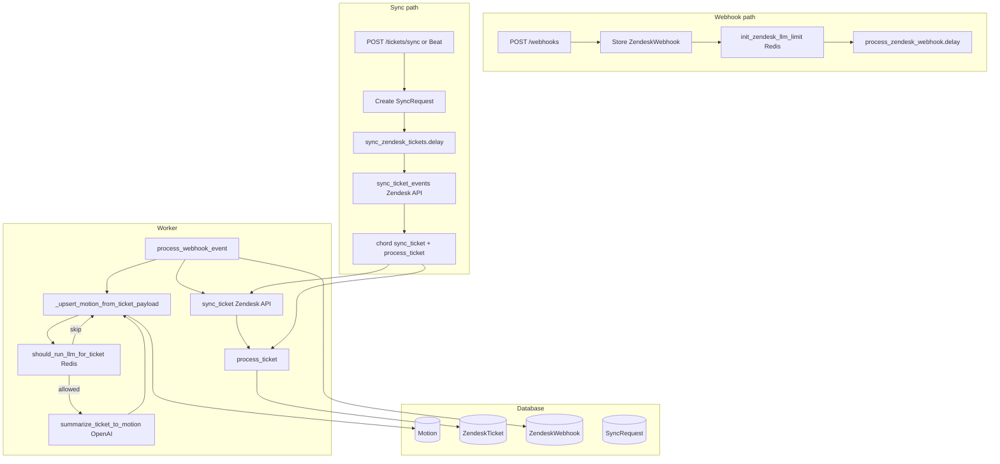

# Full Zendesk Flow (OpenAI, Database, Redis)

Complete flow: webhook/sync entry, Celery tasks, database (SQLModel/AsyncSession), OpenAI summarization, Redis (broker + LLM limiter).

**Full code**: [reference.md](.cursor/skills/celery-redis-jobs/reference.md) — storage/database (Postgres, SessionDep), config (DATABASE_URL, OPENAI_API_KEY), ZendeskService (DB + OpenAI), zendesk_llm_limiter (Redis).

---

## Flow diagram



---

## Narrative

1. **Webhook:** Zendesk POSTs to `/webhooks` → store payload in `ZendeskWebhook` → `init_zendesk_llm_limit(reset=False)` (Redis run_id for LLM cap) → `process_zendesk_webhook.delay(event.id)`.

2. **Worker (webhook):** Load event, parse payload, `_upsert_motion_from_ticket_payload` (DB lookup Motion by source_key, optional LLM via `should_run_llm_for_ticket` Redis + `summarize_ticket_to_motion` OpenAI, upsert Motion) → set `processed_at` → `sync_ticket` (Zendesk API) → `process_ticket` (DB + LLM).

3. **Sync:** `POST /tickets/sync` or Beat → create `SyncRequest` → `sync_zendesk_tickets.delay(run.id)`.

4. **Worker (sync):** Load run, `sync_ticket_events` (Zendesk API → touched ticket ids) → chord of `chain(sync_zendesk_ticket, process_zendesk_ticket)` per id → `update_sync_request`.

---

## Section 2: Routes

`SessionDep` from storage/database (see [reference.md](.cursor/skills/celery-redis-jobs/reference.md)).

### POST /webhooks

```python
async def zendesk_webhook(request: Request, session: SessionDep) -> dict:
    if not settings.zendesk_webhook_enabled:
        raise HTTPException(status_code=403, detail="Zendesk webhook is disabled")
    init_zendesk_llm_limit(reset=False)
    event = ZendeskWebhook(payload=await request.json())
    session.add(event)
    await session.commit()
    await session.refresh(event)
    process_zendesk_webhook.delay(event.id)
    return {}
```

### POST /tickets/sync

```python
async def sync_zendesk_tickets(session: SessionDep, body: SyncTicketsBody | None = Body(default=None)) -> SyncRequest:
    if body is None:
        body = SyncTicketsBody()
    init_zendesk_llm_limit(reset=True)
    run = SyncRequest(status=SyncRequestStatus.pending.value, start_date=body.start_date)
    session.add(run)
    await session.commit()
    await session.refresh(run)
    sync_zendesk_tickets_task.delay(run.id)
    return run
```

---

## Section 3: Tasks

### process_zendesk_webhook

```python
@worker.task(bind=True, max_retries=0)
def process_zendesk_webhook(self, webhook_id: int) -> None:
    if not settings.zendesk_webhook_enabled:
        return
    try:
        run_async_task(_process_zendesk_webhook(webhook_id))
    except Exception as e:
        run_async_task(_mark_webhook_error(webhook_id, str(e)))
        raise

async def _process_zendesk_webhook(webhook_id: int) -> None:
    async with AsyncSession(engine, autoflush=False, autocommit=False, expire_on_commit=False) as session:
        await ZendeskService().process_webhook_event(session, webhook_id)
```

### sync_zendesk_tickets (pipeline)

```python
@worker.task(bind=True, max_retries=0)
def sync_zendesk_tickets(self, sync_request_id: int) -> None:
    run_async_task(_sync_zendesk_tickets_for_request(sync_request_id))

async def _sync_zendesk_tickets_for_request(sync_request_id: int, ...) -> None:
    async with AsyncSession(engine, ...) as session:
        run = await session.get(SyncRequest, sync_request_id)
        run.status = SyncRequestStatus.running.value
        await session.commit()
        zendesk_ticket_ids = await ZendeskService().sync_ticket_events(session, start_time, end_time)
        if not zendesk_ticket_ids:
            run.status = SyncRequestStatus.success.value
            await session.commit()
            return
        chord(
            group([chain(sync_zendesk_ticket.s(id), process_zendesk_ticket.s()) for id in zendesk_ticket_ids])
        )(update_sync_request.s(sync_request_id))
```

### sync_zendesk_ticket, process_zendesk_ticket, update_sync_request

```python
@worker.task(bind=True, max_retries=0)
def sync_zendesk_ticket(self, zendesk_ticket_id: int) -> int | None:
    return run_async_task(_sync_zendesk_ticket(zendesk_ticket_id))

@worker.task(bind=True, max_retries=0)
def process_zendesk_ticket(self, ticket_id: int | None, ...) -> int | None:
    if ticket_id is None:
        return None
    run_async_task(_process_zendesk_ticket(ticket_id, ...))
    return ticket_id

@worker.task(bind=True, max_retries=0)
def update_sync_request(self, updated_ticket_ids: list[int | None], sync_request_id: int) -> None:
    run_async_task(_update_sync_request(updated_ticket_ids, sync_request_id))
```

---

## Section 4: ZendeskService (key methods)

### process_webhook_event

```python
async def process_webhook_event(self, session: AsyncSession, webhook_event_id: int) -> None:
    event = await session.get(ZendeskWebhook, webhook_event_id)
    if not event or event.processed_at:
        return
    payload = event.payload or {}
    parsed = parse_ticket_payload(payload)
    ticket_id = parsed.ticket.id if parsed.ticket else None
    if ticket_id is None:
        event.error = "Payload missing ticket id"
        session.add(event)
        await session.commit()
        return
    try:
        await self._upsert_motion_from_ticket_payload(session, payload)
        event.processed_at = datetime.now(timezone.utc)
        session.add(event)
        await session.commit()
        synced = await self.sync_ticket(session, int(ticket_id))
        if synced.id:
            await self.process_ticket(session, synced.id)
    except Exception as e:
        await session.rollback()
        event.error = str(e)
        session.add(event)
        await session.commit()
        raise
```

### _upsert_motion_from_ticket_payload (DB + optional OpenAI)

```python
async def _upsert_motion_from_ticket_payload(self, session: AsyncSession, payload: dict) -> Motion:
    parsed = parse_ticket_payload(payload)
    detail = parsed.ticket or TicketDetailWithTimestamps()
    ticket_id = str(detail.id or "")
    source_key = f"zendesk.tickets.{ticket_id}"
    existing = (await session.exec(select(Motion).where(Motion.source_key == source_key))).first()
    title, motion_description = detail.subject, detail.description
    result, status = MotionResult.unknown, _map_status(detail.status)

    if should_run_llm_for_ticket(int(ticket_id)):  # Redis: atomic limit per run
        full_conversation = await ZendeskClient().resolve_ticket_conversation_payload(ticket_id, payload)
        summary = await asyncio.to_thread(summarize_ticket_to_motion, full_conversation)  # OpenAI
        title = summary.title or detail.subject
        motion_description = summary.description or detail.description
        result = _map_result(summary.result)
        status = _map_status(summary.status)

    if existing:
        existing.title, existing.description, existing.result, existing.status = title, motion_description, result, status
        session.add(existing)
        await session.commit()
        return existing
    motion = Motion(source_key=source_key, title=title, description=motion_description, result=result, status=status)
    session.add(motion)
    await session.commit()
    return motion
```

### process_ticket

```python
async def process_ticket(self, session: AsyncSession, ticket_id: int, force_reprocess: bool = False) -> None:
    row = await session.get(ZendeskTicket, ticket_id)
    if not row or (row.status == TicketImportStatus.processed.value and not force_reprocess):
        return
    try:
        await self._upsert_motion_from_ticket_payload(session, row.payload)
        row.status = TicketImportStatus.processed.value
        row.error = None
    except Exception as e:
        row.status = TicketImportStatus.error.value
        row.error = str(e)
    session.add(row)
    await session.commit()
```

### sync_ticket (Zendesk API)

- Fetch full ticket from Zendesk via `ZendeskClient().get_ticket_with_side_conversations`.
- Upsert `ZendeskTicket` with payload.

### sync_ticket_events (Zendesk API)

- Call `ZendeskClient().get_ticket_events(start_time)` in a loop until end_of_stream.
- For each event, upsert/append to `ZendeskTicket.audit_events` by date.
- Return list of touched `zendesk_ticket_id`s.

---

## Section 5: OpenAI summarization

See [reference.md](.cursor/skills/celery-redis-jobs/reference.md) ZendeskService for OpenAI usage.

### summarize_ticket_to_motion

```python
def summarize_ticket_to_motion(
    full_conversation: ZendeskTicketPayload | dict,
    model: str = settings.conversation_model,
) -> TicketMotionSummary:
    conversation_text = _build_conversation_text(full_conversation)  # ticket + comments + side_convs
    content = TICKET_TO_MOTION_PROMPT_TEMPLATE.format(conversation_text=conversation_text)
    client = OpenAI(api_key=settings.openai.api_key, base_url=settings.openai.base_url)
    completion = client.chat.completions.create(model=model, messages=[{"role": "user", "content": content}])
    raw = completion.choices[0].message.content
    if not raw:
        raise ValueError("LLM returned no content")
    return _parse_llm_summary_response(raw)
```

### Prompt template

```
Summarize this Zendesk support ticket and its full conversation (main thread and side conversations) into a motion-style record.

---

{conversation_text}

---

Respond with exactly these four fields, one per line:
title: <Short, clear motion title, no ticket ID or numbering>
description: <Concise summary, key points and outcome, 2–5 sentences>
result: one of carried, defeated, unknown
status: one of ongoing, resolved, unknown
```

### TicketMotionSummary

```python
class TicketMotionSummary(BaseModel):
    title: str
    description: str
    result: str   # "carried" | "defeated" | "unknown"
    status: str   # "ongoing" | "resolved" | "unknown"
```

---

## Section 6: Redis LLM limiter

### init_zendesk_llm_limit (called by routes)

```python
def init_zendesk_llm_limit(*, reset: bool) -> None:
    """Set run_id in Redis. Routes call this before enqueueing."""
    if _env_is_test() or _env_is_production():
        return
    r = redis.from_url(settings.redis.url)
    if reset:
        r.delete(_RUN_ID_KEY)
    run_id_value = str(uuid.uuid4())
    if r.set(_RUN_ID_KEY, run_id_value, ex=_TTL_SECONDS, nx=not reset) is None:
        return
    count_key = f"zendesk:llm_limit:{run_id_value}:count"
    r.set(count_key, 0, ex=_TTL_SECONDS, nx=False)
```

### should_run_llm_for_ticket (Redis Lua)

```python
def should_run_llm_for_ticket(ticket_id: int) -> bool:
    """Return True if this ticket should call the LLM (atomic: not seen + count within limit)."""
    if _env_is_test() or _env_is_production():
        return True
    active_run_id = r.get(_RUN_ID_KEY)
    if not active_run_id:
        return False
    ticket_key = f"zendesk:llm_limit:{active_run_id}:ticket:{ticket_id}"
    count_key = f"zendesk:llm_limit:{active_run_id}:count"
    lua = """
    local ticket_key, count_key = KEYS[1], KEYS[2]
    local limit, ttl = tonumber(ARGV[1]), tonumber(ARGV[2])
    if redis.call('EXISTS', ticket_key) == 1 then return 0 end
    local new_count = redis.call('INCR', count_key)
    redis.call('EXPIRE', count_key, ttl)
    if new_count > limit then return 0 end
    redis.call('SET', ticket_key, '1', 'EX', ttl)
    return 1
    """
    allowed = r.eval(lua, 2, ticket_key, count_key, _LIMIT_TICKETS_PER_RUN, _TTL_SECONDS)
    return int(allowed) == 1
```

---

## Section 7: Models (minimal)

```python
class ZendeskWebhook(SQLModel, table=True):
    id: int | None = Field(default=None, primary_key=True)
    payload: dict = Field(default_factory=dict, sa_column=Column(JSONB, nullable=False))
    processed_at: datetime | None = None
    error: str | None = None

class ZendeskTicket(SQLModel, table=True):
    id: int | None = Field(default=None, primary_key=True)
    zendesk_ticket_id: int = Field(unique=True)
    payload: dict = Field(default_factory=dict, sa_column=Column(JSONB))
    audit_events: dict = Field(default_factory=dict, sa_column=Column(JSONB))
    status: str = Field(default="pending")  # pending | processed | error
    error: str | None = None

class SyncRequest(SQLModel, table=True):
    id: int | None = Field(default=None, primary_key=True)
    status: str = Field(default="pending")  # pending | running | success | failed
    start_date: date | None = None
    updated_ticket_ids: list[int] | None = Field(default=None, sa_column=Column(JSONB))
    finished_at: datetime | None = None

class Motion(SQLModel, table=True):
    id: int | None = Field(default=None, primary_key=True)
    source_key: str | None = None  # e.g. zendesk.tickets.123
    title: str
    description: str
    result: MotionResult  # carried | defeated | unknown
    status: MotionStatus  # ongoing | resolved | unknown
```
